# Use Remote-Storage, a Community-Derived FOSS, Offline-First, Un-Hosted, Zero-Back-End for Your Web Product  ::  a How-To Tutorial Guide.


This tutorial will cover how to very easily make an offline-first Web application without being responsible for your user's data nor back-end maintenance.

We start by learning how to leverage <a target="_blank" href="https://remotestorage.io/">Remote Storage</a> (RS) &mdash; which gives us everything but the ability to make money.  Later on we switch focus to an RS extension that, just as easily as the rest of RS, allows us to offer in-app purchases.  Why switch focus to having an app that makes money?  So you can keep the lights on and have time to make more apps, of course.


<a target="_blank" href="https://remotestorage.io/">Remote Storage</a> (RS) is a community derived effort <a target="_blank" href="https://remotestoragejs.readthedocs.io/en/latest/why.html">that's many things</a>.  Most of which are easily demonstrable with this here hands-on tutorial.

With the help of the <a target="_blank" href="https://www.npmjs.com/package/remotestoragejs">remoteStorage.js</a> NPM library RS becomes an offline-first back-end for your Web application.  Offline-first as your users' data is synced with the back-end when they're online but leverages browsers' local-storage when they're disconnected.  All without any effort from you, the app developer.

The RS ecosystem is a Bring-Your-Own-Data (BYOD) <a target="_blank" href="https://unhosted.org/">un-hosted</a> concept:  your users authenticate and authorize with any of the RS hosts in the ecosystem, or their own, and connect to your application with their data, that they bring from the RS provider of their choosing.  You, the app developer, don't own and are not responsible for their data.  They, your users, have freedom of where their data lives and how safe it is.  For all intents and purposes the RS provider can be a public offering such as <a target="_blank" href="https://rs.overhide.io">overhide.io</a> or <a target="_blank" href="https://remotestorage.io/servers/">other RS servers</a>, or the user's self-hosted system.


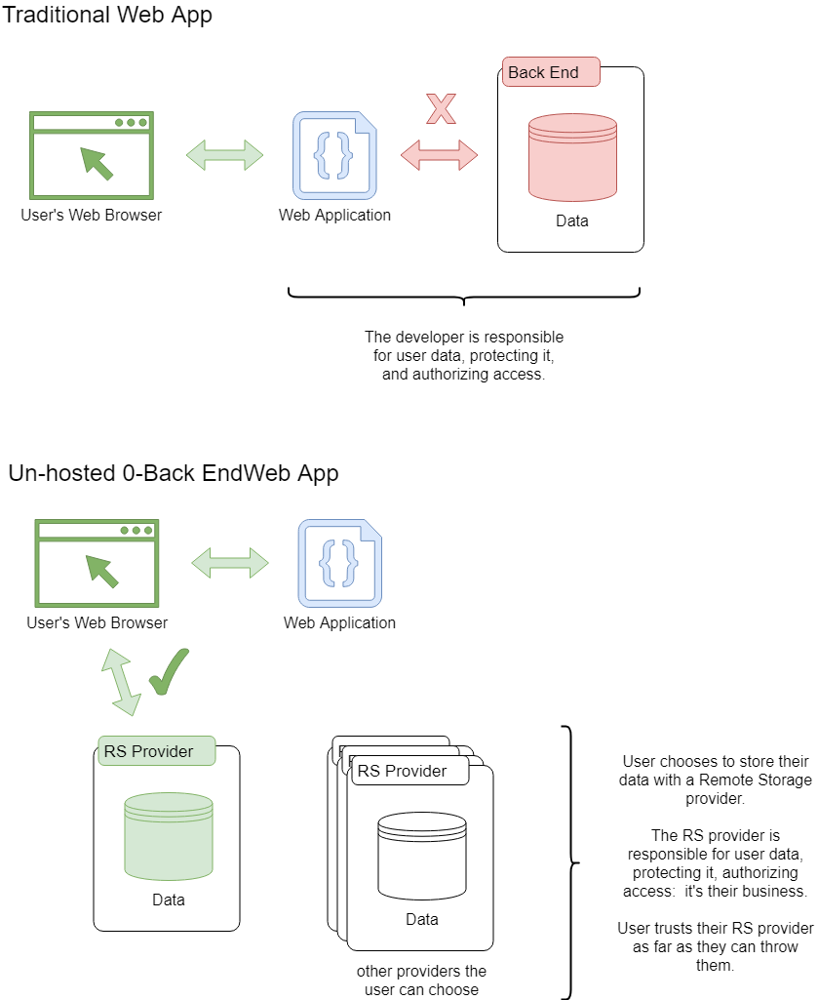


If you're into devops, the RS ecosystem is an ecosystem of self-hosted clusters that are stood up by the community for everyone to use.  You can stand up a private cluster just for your app or for the public.  You can provide RS storage for free or charge a fee in dollars or ethers.  To stand up a paid server look no further than the <a target="_blank" href="https://github.com/overhide/armadietto/blob/master/lucchetto/README.md">Lucchetto RS server</a>, batteries included.

All the code is Free Open-Source Software (FOSS).  The community is strongly pro-openness and empowering data self-ownership.

The first part of the tutorial is a hands-on materialization of all of the above in a simplistic Web app.  In the second part we will extend our example to enable in-app purchases.  We will leverage RS &mdash; albeit with the <a target="_blank" href="https://www.npmjs.com/package/lucchetto">Lucchetto bolt-on</a> &mdash; to easily receive payments in dollars and cryptos for an optional feature.


------

Questions, comments?  Let's discuss at <a target="_blank" href="https://community.remotestorage.io/">RS forums</a> or <a target="_blank" href="https://www.reddit.com/r/overhide/">r/overhide</a>.

------


## Simple Code Listings

To follow along you need to be comfortable with basic HTML, JavaScript as it relates to the DOM, <a target="_blank" href="https://git-scm.com/">git</a>, and <a target="_blank" href="https://docs.npmjs.com/downloading-and-installing-node-js-and-npm">npm</a>.  

For brevity, full code listings are not part of this write-up, but are referenced in each section from the code callouts:


> **</>**  FULL CODE 
>
> **[!!]**  RENDERED PREVIEW


All code listings are at <a target="_blank" href="https://github.com/overhide/remotestorage-tutorial">the tutorial's github repo</a>.

You don't have to do this next step &mdash; you can just see what we're talking about with the provided "RENDERED PREVIEW" links &mdash; but to render the HTML previews yourself, in some folder on your local computer:

``` 
git clone https://github.com/overhide/remotestorage-tutorial.git
cd remotestorage-tutorial
npm install -g http-server
http-server
```

Now the two HTML files we'll talk about are available to be opened with your browser on port 8080.  Open them:

​	open http://localhost:8080/1-app.html

​	open http://localhost:8080/2-iaps.html


## Our Application

Let's take a look at our example study app:


> **</>**  <a target="_blank" href="https://github.com/overhide/remotestorage-tutorial/blob/master/1-rs.html">FULL CODE</a> 
>
> **[!!]**   <a target="_blank" href="https://overhide.github.io/remotestorage-tutorial/1-rs.html">RENDERED PRVIEW</a>


After visiting the <a target="_blank" href="https://overhide.github.io/remotestorage-tutorial/1-rs.html">RENDERED PRVIEW</a> we see a cake selecting application with a *remote storage widget* at the upper left corner, some informative text, and three cake selection buttons at the bottom.  The white space in the middle is where our current cake selection will appear.  It's blank at the moment as we have never selected a cake yet:


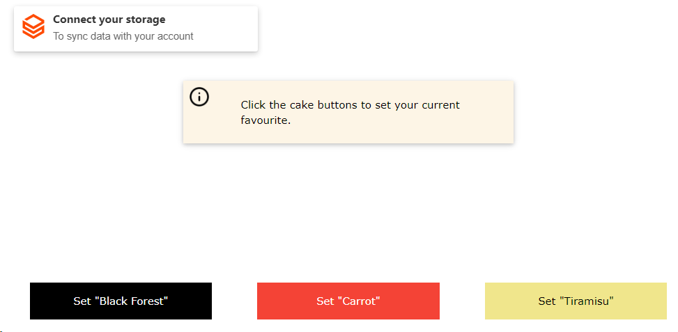


You can click on the buttons at the bottom and see a cake being selected.

With reference to the <a target="_blank" href="https://github.com/overhide/remotestorage-tutorial/blob/master/1-rs.html">FULL CODE</a> , each button has an `onClick` handler that calls the `setState` global function:


```
<button ... onClick="setState({...appstate, cake_choice: 'Black Forest'})">Set "Black Forest"</button>
...
<button ... onClick="setState({...appstate, cake_choice: 'Carrot'})">Set "Carrot"</button>
...
<button ... onClick="setState({...appstate, cake_choice: 'Tiramisu'})">Set "Tiramisu"</button>
```
<p align = "center">1-rs.html :: lines 32-38</p><br/>
The `setState` global function simply sets cake names to the `client`:


```
function setState(newState) {
  client.storeObject('AppState', 'appstate', newState);
}    
```

<p align = "center">1-rs.html :: lines 95-97</p><br/>
The parameters simply state, some object `newState` matching the JSON schema `'AppState'` should be stored as a JSON object at relative path `'appstate'`.  The pathing and schemas should make sense shortly.

Firstly, the `client`, is our application's state store, initialized earlier in the code:


```
// Construct and dependency inject
const remoteStorage = new RemoteStorage({changeEvents: { local: true, window: true, remote: true, conflicts: true }});
remoteStorage.access.claim('remotestorage-tutorial', 'rw');     
const client = remoteStorage.scope('/remotestorage-tutorial/');

// Initialize
document.addEventListener('DOMContentLoaded', function() {
  var widget = new Widget(remoteStorage, { leaveOpen:true });
  widget.attach('remotestorage-widget-anchor');
  client.cache('');
```

<p align = "center">1-rs.html :: lines 64-73</p><br/>

>  For the full documentation on `RemoteStorage` construction and `client` instantiation read the docs:
>
> - https://remotestoragejs.readthedocs.io/en/latest/js-api/remotestorage.html
> - https://remotestoragejs.readthedocs.io/en/latest/js-api/base-client.html


In brief, we instantiate `RemoteStorage` with full caching, remote synching, and state change notifications.  This is the main object that let's us talk to the *remote-storage* ecosystem.

We also instantiate the `widget` once our DOM loads &mdash; the visual component that the user interacts with for logins.  We instantiate it with `leaveOpen:true` so that it doesn't collapse and stays open at full width, at all times.  We also attach it to the `remotestorage-widget-anchor` `div` earlier in our page:  that's simply where it sits in the DOM.

The `remoteStorage.access.claim(..)` constrains that anytime a user connects their storage account to our application, the user must agree to read and write access (`'rw'`) for the `'remotestorage-tutorial'` namespace.  This doesn't concern us for now:  we haven't yet tried connecting to a remote server.  But it will concern us soon enough.

The actual `client` is scoped to the `/remotestorage-tutorial/` path for its interactions &mdash; this means that changes to files within this path will cause change notifications through this client..  Notice that the path repeats the claim's namespace.

Lastly, we kickoff the change notification off of our cache with `client.cache('')`.  The empty parameter string dictates we're interested in all sub-paths for change notifications &mdash; although in this app we only have one sub-path; `'appstate'`.

With these instantiations in place we're ready to use our applications unique namespace, 'remotestorage-tutorial', in both local and remote stores.


> Calling it a namespace and pretending that it needs to be unique is an over-simplification.  There is a whole gamut of interactions possible via sharing these paths as per RS data-modules.  But that's a more advanced topic.
>
> https://remotestoragejs.readthedocs.io/en/latest/data-modules.html


Let's move on to the importance of the `{ local: true, window: true, remote: true, conflicts: true }` options passed into the `RemoteStorage` constructor and the `client.cache('')` invocation.  With these we're asking that, as the resultant `client` tracks our application state, it update our rendering widgets with a one-way state flow.

We've already seen the `client` receiving new state via the `client.storeObject(..)`.  Fully decoupled from these writes we have the state change listener:


```
client.on('change', (event) => {
  if (event.relativePath === 'appstate') {
    appstate = event.newValue;
	document.getElementById('choice').innerHTML = appstate.cake_choice;
  }
});   
```

<p align = "center">1-rs.html :: lines 83-88</p><br/>
Here we're registering an event handler against the `client`.  This code will get called on every local in-browser or remote change to any object under our previously registered scope (the `'/remotestorage-tutorial/'` root path).

In our handler above we're only interested in changes to the `/appstate` sub-path.

On an update we simply set the value of our `#choice` `div` to the new cake choice.


What we're achieving is a one-way state flow through our `client`:


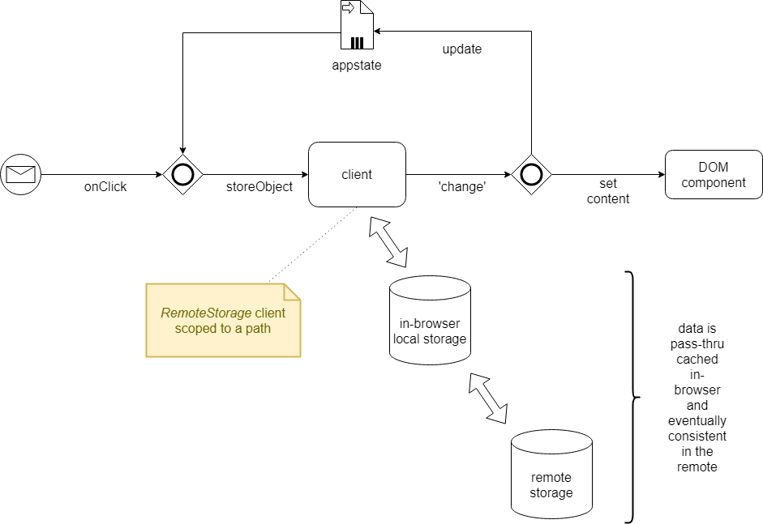


What we're also transparently achieving is reliable persistence of the app's state in our user's provided storage:  both local and remote.  In fact, if you press F5 in your <a target="_blank" href="https://overhide.github.io/remotestorage-tutorial/1-rs.html">RENDERED PRVIEW</a>, after the page refresh the first thing the `client` will do is cause a `change` notification to our handler with the last app's state it was continuously caching in the browser's local-storage.


Let's connect to a *remote-storage* server to ensure we sync our application changes outside of our current browser.

For this tutorial we will use the <a target="_blank" href="https://test.rs.overhide.io">@test.rs.overhide.io</a> server, but <a target="_blank" href="https://remotestorage.io/servers/">there are others</a>.

<a target="_blank" href="https://test.rs.overhide.io">@test.rs.overhide.io</a> is a free *remote-storage* server meant for testing and playing around.  It pretends to require money but it's all fake make-pretend US dollar transactions and testnet Ethereum transactions.

You can stand up the exact same server on your own machine from the <a target="_blank" href="https://github.com/overhide/armadietto">Armadietto+Lucchetto</a> repository, or just use <a target="_blank" href="https://test.rs.overhide.io">@test.rs.overhide.io</a> for now.

Click on the *remote-storage* widget to start logging in:


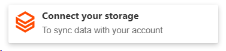


In the input box type in `@test.rs.overhide.io` and click on "Connect".

You're presented with a bunch of login options.  For now, scroll all the way to the bottom to the "secret token" card and click on "generate new".  The system will generate a new secret token for your login.  Save this in your browser's password manager when prompted, or copy it (the little blue clipboard) and save it off manually.


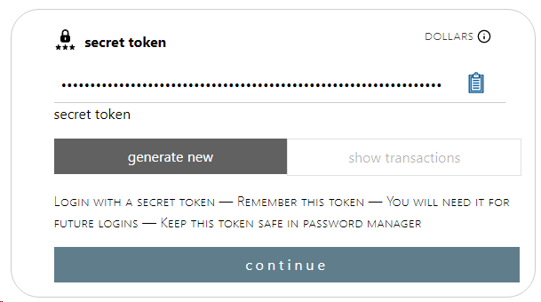


Click "continue".

You're prompted for a payment through Stripe.com.  This is a fake US dollars payment on the Stripe.com testnet.  


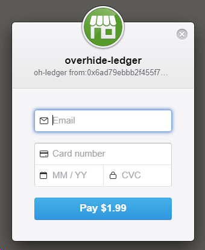


Enter fake information in the fields as per the instructions on screen:


Now you're back in our cake example app and you're connected with your newly acquired *remote-storage*.

You can use the exact same storage in <a target="_blank" href="https://remotestorage.io/apps/">any other RS application</a>.  Hope you saved off your secret token!  Although your in-browser password manager should remember, as long as you stick to it.

To make your life easier, your best bet is to likely use social login providers on that login screen, or an Ethereum wallet if you can connect it.  Play around with the various options.


Now, as you click on the various cakes, you should see the *remote-storage* widget spin and sync: it's synching to your newly acquired *remote-storage*.


Before we conclude this section, let's get back to our `appstate` object as it's saved in the `client`:


```
client.storeObject('AppState', 'appstate', newState);
```

<p align = "center">1-rs.html :: line 95</p><br/>
We mentioned that the first parameter `'AppState'` indicates the JSON schema expected of the third parameter.  This JSON schema is registered against the `client`:

``` 
const AppState = {
  type: 'object',
  properties: {
	cakce_choice: {
	  type: 'string'
	}
  },
  required: ['cake_choice']
};
...
client.declareType('AppState', AppState);
```

<p align = "center">1-rs.html :: lines 49-57 and 77</p><br/>
The `'AppState'` schema with the value from `newState` is saved under the path `appstate`, which is a path relative to the scope path of our `client`.  Hence we can think of the object being at `/remotestorage-tutorial/appstate`.


## Our Application With In-App Purchases

Now that we're comfortable leveraging *Remote Storage* to drive and cache our application's state, let's add in-app purchases to the mix:


> **</>**  <a target="_blank" href="https://github.com/overhide/remotestorage-tutorial/blob/master/2-iaps.html">FULL CODE</a> 
>
> **[!!]**   <a target="_blank" href="https://overhide.github.io/remotestorage-tutorial/2-iaps.html">RENDERED PRVIEW</a>


The main difference here is the grey in-app purchase button offered to your users at the bottom of our app, as per the new <a target="_blank" href="https://overhide.github.io/remotestorage-tutorial/2-iaps.html">RENDERED PRVIEW</a>:


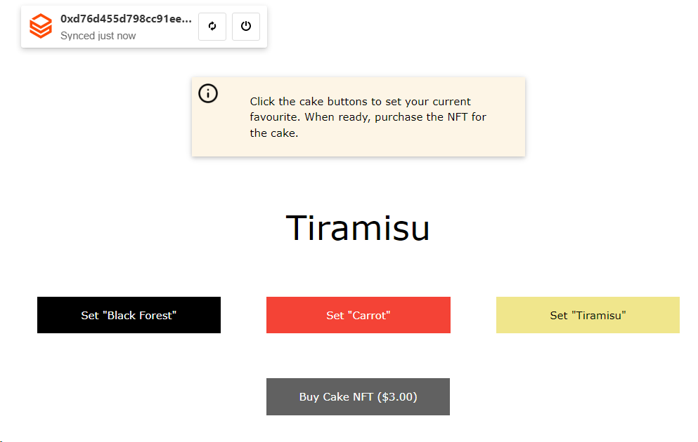


The new option to "Buy Cake NFT" for $3 provides a nice value-add to your customer.

The action of this button will differ based on several factors of your user's *remote-storage* connection.  At the end of the day, however, the button will authorize, subsequently trigger an event, prompting our app to download a piece of data that's behind a $3 paywall.  This is a piece of data that we &mdash; the app developers &mdash; setup (well, I setup for this example).  It's not part of the user's data, it's from the developer's *remote-storage*. 

If you're following along as the user that just logged into the <a target="_blank" href="https://test.rs.overhide.io">@test.rs.overhide.io</a> *remote-storage*, then you should still be logged into this new page with your valid *remote-storage* connection:  it's the same domain hence the same token authorizes.  Since <a target="_blank" href="https://test.rs.overhide.io">@test.rs.overhide.io</a> is a so called *Lucchetto* extended RS server &mdash; meaning it plays nice with this new in-app purchase button from the https://pay2my.app widgets &mdash; our click-through should be seamless.  We'll just need to top-up the $3 for the new IAP.

Why are we paying again?

Keep in mind that the earlier $1.99 payment was to the <a target="_blank" href="https://test.rs.overhide.io">@test.rs.overhide.io</a> *remote-storage* provider:  for the storage.  This $3 payment is for the extra in-app value add.


> If your user logged into this app with a regular RS server &mdash; not *Lucchetto* extended &mdash; the IAP will work nearly just as well.  The notable difference being extra prompts whenever the user revisits the app; as the IAP button cannot leverage non-extended RS authorization for payments:  regular RS servers return tokens without the extra necessary metadata.


Regardless, clicking on the button will eventually lead to the following handler executing (from the <a target="_blank" href="https://github.com/overhide/remotestorage-tutorial/blob/master/2-iaps.html">FULL CODE</a>):


```
window.addEventListener('pay2myapp-appsell-sku-clicked', async (event) => { 
  try {
	const result = await lucchetto.getSku(`https://test.rs.overhide.io`, event.detail);
	alert(result);
  } catch (event) {
	console.error(`error :: no file for sku ${event.detail.sku}`);
  }      
}, false);    
```

<p align = "center">2-iaps.html :: lines 145-152</p><br/>

The `pay2myapp-appsell-sku-clicked` event comes from the https://pay2my.app widgets, which are the same widgets providing authentication and authorization in our <a target="_blank" href="https://test.rs.overhide.io">@test.rs.overhide.io</a> server earlier.  


> The `pay2myapp-appsell-sku-clicked` event is documented as part of the <a target="_blank" href="https://github.com/overhide/pay2my.app#pay2myapp-appsell-">pay2myapp-appsell</a> Web component.  


Reading the handler code above, we use the `event` to retrieve a `result` via `lucchetto.getSku(..)` and `alert(result)` it out to the user.  The `alert(result)` is our app's value-add; you'll clearly do better things with he data.  The `lucchetto.getSku(..)` call takes the event's `detail` object and knows how to interpret it to retrieve the right content from the *Lucchetto* extended RS server provided as the first parameter, `'https://test.rs.overhide.io'` in our case.  


> Keep in mind, the `lucchetto.getSku(..)` uses your &mdash; the app developers &mdash; *Lucchetto* RS connection to get paywall data, hence your RS server's connection string needs to be provided.  The `event.detail` object provides the chosen ledger's `from` (client) and `to` (your) addresses, and the user's `signature` for some `message`, essentially all that's needed for the *Lucchetto* RS server to validate authentication and payments on the ledger:  it's not sufficient to have this done in the browser, the RS server validates for itself.
>
> 
>
> 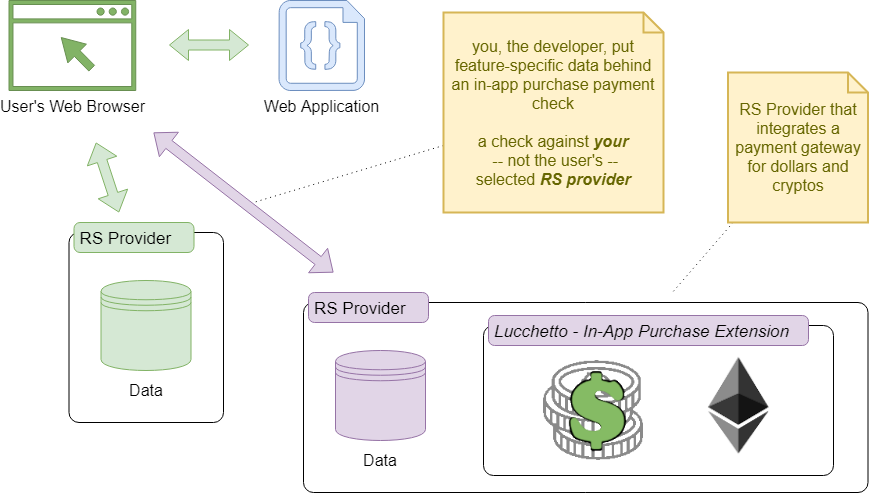


We'll cover how to add this SKU content to the RS server later.

That `lucchetto` object used to `lucchetto.getSku(..)` is the piece of glue that connects *remote-storage* authorization to these IAP buttons in your application.  We really only use it in two places, this `lucchetto.getSku(..)` and earlier, to instantiate and initialize:


```
const lucchetto = new Lucchetto({
  remoteStorage: remoteStorage, 
  overhideIsTest: true, 
  overhideApiKey: '0x6cc3b096ef53d2e70152bed8f34448ddfaae34b3aa745b69a1d42f083a44080b',
  pay2myAppHub: document.getElementById('demo-hub')});
```

<p align = "center">2-iaps.html :: line 104-108</p><br/>

When initializing `lucchetto` we provide the constructor with an options object including the *remote-storage* instance we normally use, `remoteStorage`.   This let's `lucchetto` leverage the current *remote-storage* signed-in user details &mdash; to make in-app purchase flows as banal as possible.

Next, we set the `overhideIsTest` option to `true` to indicate we're using testnets.  In a live production system you'd set this to `false`.  

We're also providing an `overhideApiKey`.  An `overhideApiKey` is your, the developer's, key to access the ledgers through the *overhide* cluster.  It's not a big deal to get an API key and there aren't really any restrictions besides the normal rate limits (see https://pay2my.app).  The `overhideApiKey` is optional if the `remoteStorage` connection has your users always connecting from a *Lucchetto* extended RS server such as https://rs.overhide.io.  But, as not every user will have such a connection, users are likely to come from https://5apps.com and other providers.  It's prudent to provide a default here:  otherwise we can't talk to the *overhide* cluster to interact with ledgers.

Lastly, the *pay2myAppHub* option is set to the `HTMLElement` reference of the <a target="_blank" href="https://github.com/overhide/pay2my.app#pay2myapp-hub-">pay2myapp-hub</a> Web component, the first Web component in the listing below (referenced by `id`).  The *lucchetto* instance we're creating influences all the in-app purchase Web components in this code listing.


```
<pay2myapp-hub id="demo-hub" isTest noCache></pay2myapp-hub>      

<pay2myapp-login  
  hubId="demo-hub"
  overhideSocialMicrosoftEnabled
  overhideSocialGoogleEnabled
  overhideWeb3Enabled
  ethereumWeb3Enabled
  overhideSecretTokenEnabled>
</pay2myapp-login>

<pay2myapp-appsell 
  hubId="demo-hub" 
  sku="buy-nft"
  priceDollars="3"
  authorizedMessage="Cake NFT"
  unauthorizedTemplate="Buy Cake NFT ($${topup})"
  ethereumAddress="0xd6106c445A07a6A1caF02FC8050F1FDe30d7cE8b"
  overhideAddress="0xd6106c445A07a6A1caF02FC8050F1FDe30d7cE8b">
</pay2myapp-appsell>
```

<p align = "center">2-iaps.html :: lines 55-74</p><br/>
The first Web component is the before mentioned <a target="_blank" href="https://github.com/overhide/pay2my.app#pay2myapp-hub-">pay2myapp-hub</a>.  It's labelled with an ID `"demo-hub"` so it can be referenced from the other components (<a target="_blank" href="https://github.com/overhide/pay2my.app#setting-the-pay2myapp-hub-programatically">or programatically</a> in bigger apps with frameworks).  The hub is the main component that communicates with ledgers and services all the other components.  The `isTest`  attribute specifies that the hub will communicate with testnet ledgers.  Leave this attribute out for production deployments.  The `noCache` attribute asks the system not to cache credentials:  considering we use *remote-storage* to do that for us.   


> To get your own `apiKey` for your application visit https://token.overhide.io/register.
>
> Ensure to get the right key for your testnet app and a production key for your live app deployment.


The second Web component ties into our hub via `hubId` and specifies all the login methods available to our app, it's pretty self explanatory.

The third component is the actual upsell (app-sell?) button.  it specifies the `sku` &mdash; the tag given to the feature we're selling.  The `priceDollars` is the cost.  The cost is always in US dollars and is automatically converted to ethers if need be.  The `authorizedMessage` is the button-text when authorized.  The `unauthrizedTemplate` can include the `$${topup}` placeholder for the outstanding dollar amount.  

The `ethereumAddress` and `overhideAddress` are both Ethereum public addresses used to receive payments, but on two separate ledgers.  Ethereum is self explanatory.  The *overhide* ledger is a US dollar receipts ledger that uses Ethereum addresses but does not do value transfers.  Value transfers are through Stripe.com.  


> There are many more configurations of these buttons as described in the <a target="_blank" href="https://github.com/overhide/pay2my.app#pay2myapp-appsell-">pay2myapp-appsell</a> documentation.  Even more cryptos such as Bitcoin, and growing.  But for *Lucchetto* RS we only focus on cryptos within the Ethereum address space.


Let's focus on these addresses a bit more.  This is a feature upsell button that, when clicked, produces the previously mentioned `pay2myapp-appsell-sku-clicked` event and leads us to download a value using `lucchetto.getSku(..)`.   Authorization here means:  sufficient payments were made from our user's address to either the `ethereumAddress` for ethers or the `overhideAddress` for dollars.


Let me describe what I did to make this address of `0xd6106c445A07a6A1caF02FC8050F1FDe30d7cE8b` available to this Web component, and hopefully this will make sense for when you want to add your own.


``` 
  ethereumAddress="0xd6106c445A07a6A1caF02FC8050F1FDe30d7cE8b"
  overhideAddress="0xd6106c445A07a6A1caF02FC8050F1FDe30d7cE8b">
```

<p align = "center">2-iaps.html :: lines 72-73</p><br/>
The process is the same for mainnet/prod/live as for testnet/fake, except with different networks.  

First and foremost I setup the <a target="_blank" href="https://metamask.io/">MetaMask</a> wallet in my browser and one of my Ethereum addresses is `0xd6106c445A07a6A1caF02FC8050F1FDe30d7cE8b`.  

By virtue of having this address, I'm already setup to receive ethers.  I just need to provide this address for `ethereumAddress`.

For US dollars it's a bit more involved as we need to connect this Ethereum address to a Stripe.com account.

We point our browser at <a target="_blank" href="https://test.ledger.overhide.io/onboard">testnet onboarding</a> and start the onboarding.  I connected my <a target="_blank" href="https://metamask.io/">MetaMask</a> wallet to the onboarding page so I can use its addresses.  

Once clicked through to the Stripe.com account simply skip the form:  unfortunately when you're ready for production you cannot just skip this Stripe.com part of onboarding.

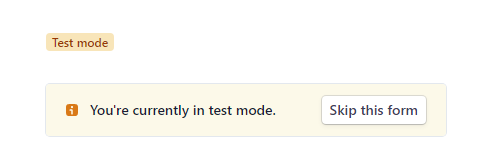


Once onboarded, the <a target="_blank" href="https://overhide.io">overhide US dollars ledger</a> will record US dollars payments through Stripe.com between your users' addresses and your onboarded address, enabling *Ledger-Based Authorizations*.


> For production onboarding with Ethereum simply use the same address, but with the *mainnet*.
>
> For the *overhide* US dollars ledger you'll need to do a full onboarding with <a target="_blank" href="https://ledger.overhide.io/onboard">the production flow</a>.


Now we're onboarded.  We know how these addresses factor in.  But what about the SKU data?

If you recall earlier, upon authorization, we retrieved data via `lucchetto.getSku(..)`.  Before that we created a <a target="_blank" href="https://github.com/overhide/pay2my.app#pay2myapp-appsell-">pay2myapp-appsell</a> button specifying the `sku` and `priceDollars`.

How do we set this up?

Turns out the SKUs are simply *remote-storage* stored pieces of `plain/text` data served by *Lucchetto* extended RS servers, such as  <a target="_blank" href="https://test.rs.overhide.io">@test.rs.overhide.io</a>.  

To configure them we simply need to <a target="_blank" href="https://overhide.github.io/armadietto/lucchetto/onboard.html#">use a RS app</a>.


> As of this writing...
>
> Configure your testnet SKUs with  <a target="_blank" href="https://test.rs.overhide.io">@test.rs.overhide.io</a>..
>
> Configure your production SKUs with  <a target="_blank" href="https://rs.overhide.io">@rs.overhide.io</a>.
>
> Check <a target="_blank" href="https://remotestorage.io/servers/">the RS servers page</a> for more options, if any.


The <a target="_blank" href="https://overhide.github.io/armadietto/lucchetto/onboard.html#">Lucchetto SKU onboard app</a> should be self explanatory.  You connect to a *Lucchetto* extended RS server such as one of the above listed.  The connected address must match the `ethereumAddress` and the `overhideAddress`.  If you made them different, you'll need to maintain separate RS connections to manage your SKUs.  For sanity, likely best to keep them the same.

In my case, I'd connect <a target="_blank" href="https://overhide.github.io/armadietto/lucchetto/onboard.html#">the app</a> to  <a target="_blank" href="https://test.rs.overhide.io">@test.rs.overhide.io</a> with `0xd6106c445A07a6A1caF02FC8050F1FDe30d7cE8b` from my crypto wallet.

Once connected <a target="_blank" href="https://overhide.github.io/armadietto/lucchetto/onboard.html#">the app</a> lets you list existing SKUs, delete them, but most important, insert new ones using the "UPSERT" card.  Simply fill in the *price*, `3` in our case ($3), the *within*, `0` in our case (indefinite), and the *SKU*, `buy-nft` in our case, all matching our button.  Finally, set the *data*, which is the content returned from the `lucchetto.getSku(..)` call.  For our purposes, I set  it to `The cake is a lie!`.


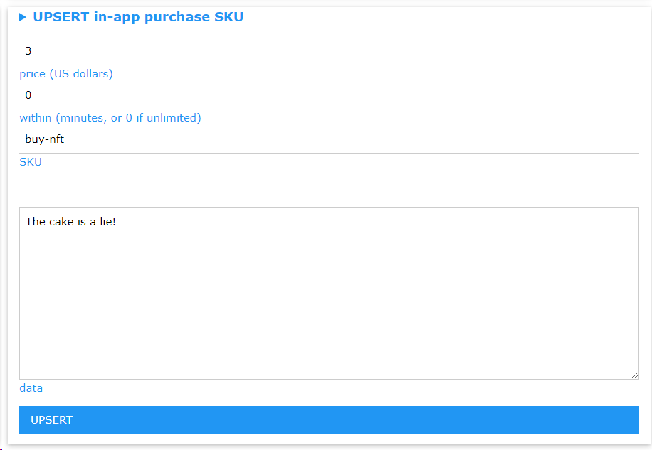


Once you "UPSERT" you should see a confirmation, and you're done.  The SKU is ready to use:


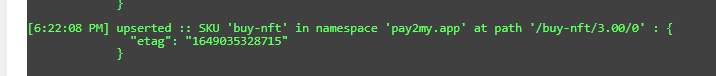


*Remote-storage* is a fantastic way to write your applications.

Adding in-app purchases hopefully means you'll be able to get some kick-backs for the wonderful work you do.

Thanks for reading.
