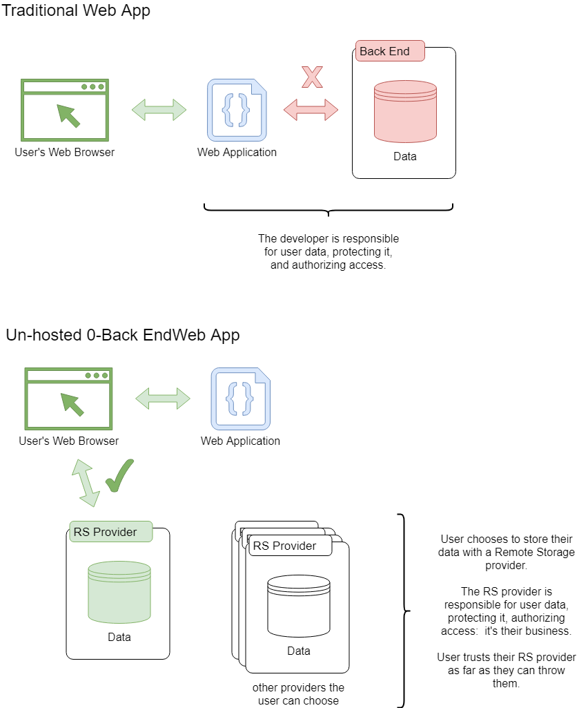

# Use Remote-Storage, a Community-Derived FOSS, Offline-First, Un-Hosted, Zero-Back-End for Your Web Product  ::  a How-To Tutorial Guide.


This tutorial will cover how to very easily make an offline-first Web application without being responsible for your user's data nor back-end maintenance.

We start by learning how to leverage [Remote Storage](https://remotestorage.io/) (RS) &mdash; which gives us everything but the ability to make money.  Later on we switch focus to an RS extension that, just as easily as the rest of RS, allows us to offer in-app purchases.  Why switch focus to having an app that makes money?  So you can keep the lights on and have time to make more apps, of course.


[Remote Storage](https://remotestorage.io/) (RS) is a community derived effort [that's many things](https://remotestoragejs.readthedocs.io/en/latest/why.html).  Most of which are easily demonstrable with this here hands-on tutorial.

With the help of the [remoteStorage.js](https://www.npmjs.com/package/remotestoragejs) NPM library RS becomes an offline-first back-end for your Web application.  Offline-first as your users' data is synced with the back-end when they're online but leverages browsers' local-storage when they're disconnected.  All without any effort from you, the app developer.





The RS ecosystem is a Bring-Your-Own-Data (BYOD) [un-hosted](https://unhosted.org/) concept:  your users authenticate and authorize with any of the RS hosts in the ecosystem, or their own, and connect to your application with their data, that they bring from the RS provider of their choosing.  You, the app developer, don't own and are not responsible for their data.  They, your users, have freedom of where their data lives and how safe it is.  For all intents and purposes the RS provider can be a public offering such as [overhide.io](https://rs.overhide.io) or [other RS servers](https://remotestorage.io/servers/), or the user's self-hosted system.

If you're into devops, the RS ecosystem is an ecosystem of self-hosted clusters that are stood up by the community for everyone to use.  You can stand up a private cluster just for your app or for the public.  You can provide RS storage for free or charge a fee in dollars or ethers.  To stand up a paid server look no further than the [Lucchetto RS server](https://github.com/overhide/armadietto/blob/master/lucchetto/README.md), batteries included.

All the code is Free Open-Source Software (FOSS).  The community is strongly pro-openness and empowering data self-ownership.

The first part of the tutorial is a hands-on materialization of all of the above in a simplistic Web app.  In the second part we will extend our example to enable in-app purchases.  We will leverage RS &mdash; albeit with the [Lucchetto bolt-on](https://www.npmjs.com/package/lucchetto) &mdash; to easily receive payments in dollars and cryptos for a an optional feature.


------

Questions, comments?  Let's discuss at [RS forums](https://community.remotestorage.io/) or [r/overhide](https://www.reddit.com/r/overhide/).

------


## Simple Code Listings

To follow along you need to be comfortable with basic HTML, JavaScript as it relates to the DOM, [git](https://git-scm.com/), and [npm](https://docs.npmjs.com/downloading-and-installing-node-js-and-npm).  

For brevity, full code listings are not part of this write-up, but are referenced in each section from the code callouts:


> **</>**  FULL CODE 
>
> **[!!]**  RENDERED PREVIEW


All code listings are at <a target="_blank" href="https://github.com/overhide/remotestorage-tutorial">the tutorial's github repo</a>.

You don't have to do this next step &mdash; you can just see what we're talking about with the provided "RENDERED PREVIEW" links &mdash; but to render the HTML previews yourself, in some folder on your local computer:

``` 
git clone https://github.com/overhide/remotestorage-tutorial.git
cd remotestorage-tutorial
npm install -g http-server
http-server
```

Now the two HTML files we'll talk about are available to be opened with your browser on port 8080.  Open them:

​	open http://localhost:8080/1-app.html

​	open http://localhost:8080/2-app+iaps.html


## Study App

Let's take a look at our example study app:


> **</>**  <a target="_blank" href="https://github.com/overhide/pay2my.app/blob/master/howto/intro/code/1_first.html">FULL CODE</a> 
>
> **[!!]**   <a target="_blank" href="https://overhide.github.io/pay2my.app/howto/intro/code/1_first.html">RENDERED PRVIEW</a>


With reference to the above code, let's go through the notable bits.

